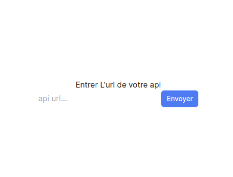
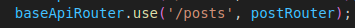
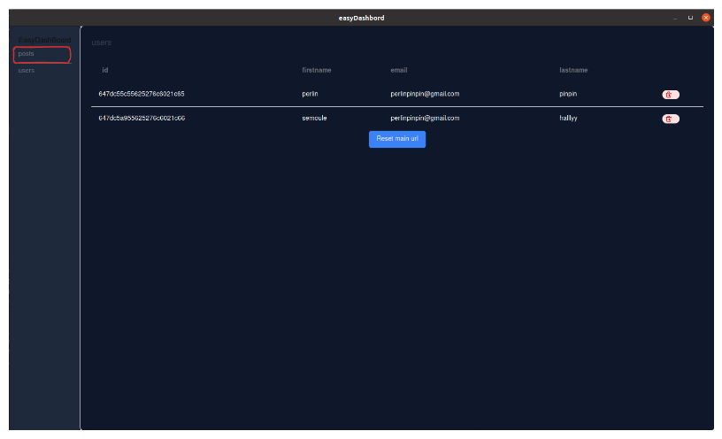

# Easy Dashboard ⚠️(in progress)⚠️

Dashbord to represent your database mongdb to view your data and delete data

## How does it work?

At the start of the application enter the base url of your api your api must return all your database collections

`db.db.listCollections().toArray();`

## When you've entered your api url
### Things you need to know

    - your route must have the same name as your collection name 

